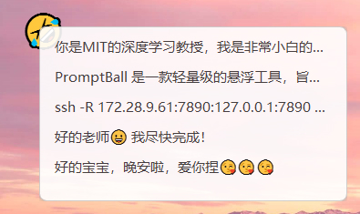

# PromptBall
PromptBall 是一款轻量级的悬浮工具，旨在为用户提供快速访问和管理常用文本片段的便捷方式。
## 应用场景
简而言之，经常会用的的文本可以方便地存入。例如：回复导师的、回复女朋友的🤣、常用的Linux命令等等捏。


## 环境
只需要常规的python环境，建议3.7以上。
```bash
pip install pyinstaller
pip install PyQt5
```
其他的库缺什么安什么就ok
## 打包
```bash
pyinstaller --noconsole --onefile --icon=pb.ico --name=PromptBall --hidden-import=PyQt5.sip floating_ball.py
```
## 使用
### 启动 PromptBall
运行 `PromptBall.exe` 可执行文件。一个悬浮球将出现在您的桌面上。
### 添加文本片段
1. **复制文本**到剪贴板。
2. **右键单击**悬浮球，将剪贴板中的文本添加为新的选项。
### 查看和管理选项
1. **左键单击**悬浮球，显示选项列表。
2. **左键单击**某个选项，将其复制到剪贴板。
3. **右键单击**某个选项，删除该选项。
### 更改悬浮球的表情符号
1. **复制一个表情符号**到剪贴板。
2. **按住 Shift 键并右键单击**悬浮球，设置新的表情符号。
   - 如果剪贴板中的内容是有效的表情符号，悬浮球将更新为新的表情符号，并在配置文件中保存设置。
   - 如果剪贴板中的内容不是表情符号，将显示提示信息：“剪切板中的内容不是表情符号。”
### 设置自定义保存目录
1. **复制一个有效的文件夹路径**到剪贴板。
2. **按住 Ctrl 键并右键单击**悬浮球，设置该路径为新的保存目录。
   - 选项将保存在该目录下的 `options.json` 文件中，以便持久化。
### 退出 PromptBall
**按住 Ctrl 键并左键单击悬浮球**，以退出程序。
## 配置
PromptBall 将配置文件保存在默认的保存目录（`~/.floating_ball/config.json`）中，用于保存保存路径和当前的表情符号。您可以手动查看和编辑该文件以进行高级配置。
